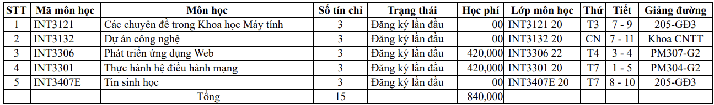
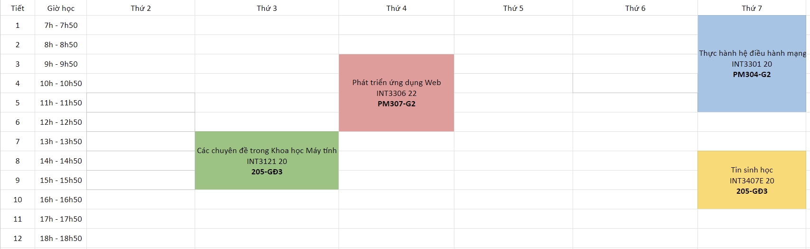

# Auto-VNU-Timetable - Tạo thời khóa biểu VNU tự động

Tự động tạo file excel thời khóa biểu từ file pdf kết quả đăng ký học, giúp các bạn sinh viên dễ dàng nắm lịch học tập cũng như tránh sai sót/thiếu lớp khi làm thủ công.

Từ dữ liệu này:

Chuyển sang như này:


> ⚠️ Hiện tại chỉ hỗ trợ UET, các trường khác trong VNU vẫn có thể dùng nhưng có thể thiếu lớp. Mình sẽ lên kế hoạch hỗ trợ sau :>

## Sử dụng tool

Đã có hướng dẫn tại trang chủ: [link](WIP)

## Về cập nhật danh sách đăng ký trên dangkyhoc

Do file pdf có thể không bao gồm lớp lý thuyết/thực hành 1 số môn, nên tool này sẽ không thể hoàn chỉnh nếu không có đóng góp của các bạn sinh viên. Xem chi tiết thêm [về vấn đề này](WIP)

Rất cảm ơn các bạn mỗi kỳ đều cập nhật danh sách đăng ký học mới!

## Đóng góp

Nếu có bất kỳ lỗi trong quá trình sử dụng hoặc đề xuất/ý kiến, bạn luôn có thể [phản hồi tại đây](https://github.com/manhhungpc/auto-vnu-timetable/issues)

# Dành cho việc phát triển - For developing the app

## Tech

[SvelteKit](https://kit.svelte.dev/) with GitHub API

## Developing

Install dependencies with `npm install` (or `pnpm install` - recommended), start a development server:

```bash
npm run dev

# or start the server and open the app in a new browser tab
npm run dev -- --open
```

## Building

To create a production version of your app:

```bash
npm run build
```

You can preview the production build with `npm run preview`.
